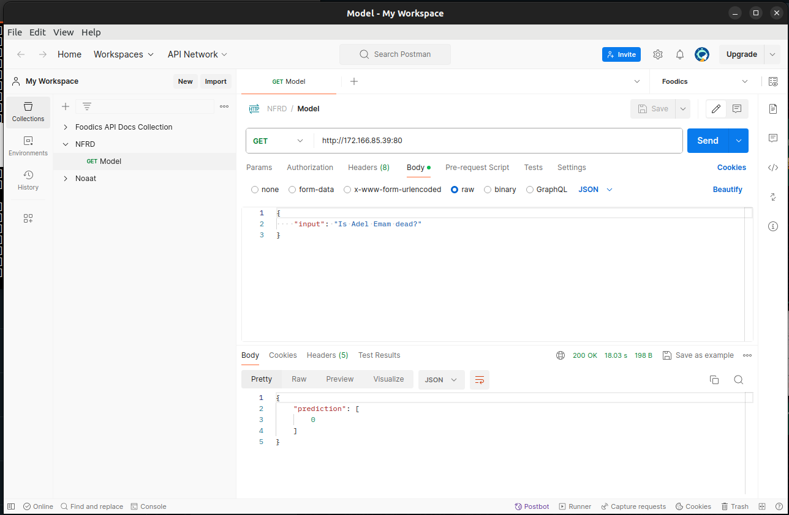

# Model Server
This is a flask server that accepts requests to predict whether a certain input is a rumor or not. It runs on port `80` and is currently running on `model-balancer` load balancer whose ip is `172.166.85.39` which maps requests to two VMs.
One of the VMs acts as a `Jump Server` to the other VM due to limited public IPs.

## How to run:
1. It is encourged to create a virtual environment for the server to achieve isolation and reproducibility, you can do so by running the command `python3 -m venv env` and then activating the virtual environment by running `source env/bin/activate`.

    * If you do not have the venv module installed on your machine, try running `apt install python3.10-venv`, feel free to change the python version to the one you use.

2. Afterwards, the python dependencies should be installed using `pip install -r requirements.txt`. If the downloaded packages are too big for your machine's storage/memory, consider passing the `--no-cache-dir` at the end of the command, or creating a swap memory.

3. The next step would be downloading the trained model [`model.pth`](https://drive.google.com/file/d/1-7BdacdMZvH5HzST38NlPDjI-F7NngEu/view), this can be done using the gdown module which should be installed using `pip install gdown`. Download it using the command `gdown --id 1-7BdacdMZvH5HzST38NlPDjI-F7NngEu`.

4. The last step would be running the flask server, you can do that simply by running `python3 -m server`. The server can be accessed through `http://172.166.85.39:80`.

## Endpoint definition:
The server accepts requests to a two endpoints, `/` and `/health`.
- The body of the request for `/` should be in json format in the form of

`{
    "input": "<possible rumor to check>"
}`

The current format of the response is:

`{
    "prediction": [
        <boolean 0 or 1>
    ]
}`

- Request for `/health` is an endpoint for the load balancer to check if the VM can accept requests or not.

## Example

